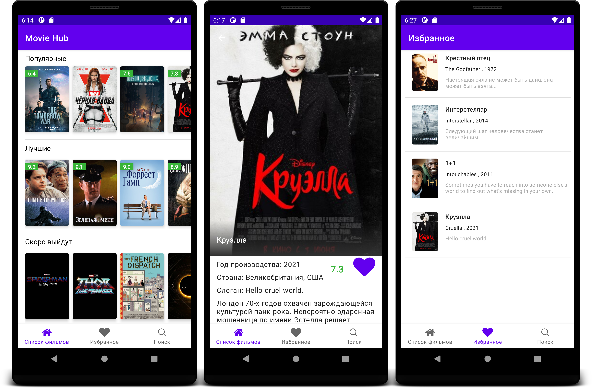
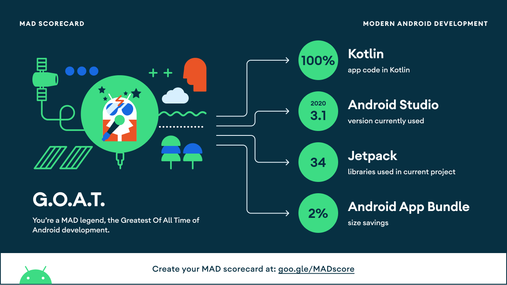

# MovieHub
The MovieHub - Андоид приложение использующее [Kinopoisk Api Unofficial](https://kinopoiskapiunofficial.tech/) для отображения информации о фильмах, с возможностью добавления в локальную базу данных.

## Стек технологий:

- [Kotlin](https://kotlinlang.org/)
- [Coroutines](https://kotlinlang.org/docs/reference/coroutines-overview.html) 
- [Dagger-Hilt](https://developer.android.com/training/dependency-injection/hilt-android)
- JetPack

  - [LiveData](https://developer.android.com/topic/libraries/architecture/livedata) 
  - [ViewModel](https://developer.android.com/topic/libraries/architecture/viewmodel) 
  - [ViewBinding](https://developer.android.com/topic/libraries/view-binding)
  - [Room](https://developer.android.com/topic/libraries/architecture/room)
  - [Navigation](https://developer.android.com/guide/navigation/navigation-getting-started)
  - [View Binding](https://developer.android.com/topic/libraries/view-binding)
  - [MVVM Architecture]() (View - ViewBinding - ViewModel - Model)
  - Repository pattern
- [Retrofit2 & OkHttp3](https://github.com/square/retrofit)
- [Gson](https://github.com/google/gson)
- [Material-Components](https://github.com/material-components/material-components-android)
- [ShimmerLayout](http://facebook.github.io/shimmer-android/)
- [Detekt](https://detekt.github.io/detekt/)

## Архитектура

В этом проекте используется архитектура MVVM и применяются лучшие практики рекомендованные Goggle [Guide to app architecture](https://developer.android.com/jetpack/guide)

## MAD Scorecard

